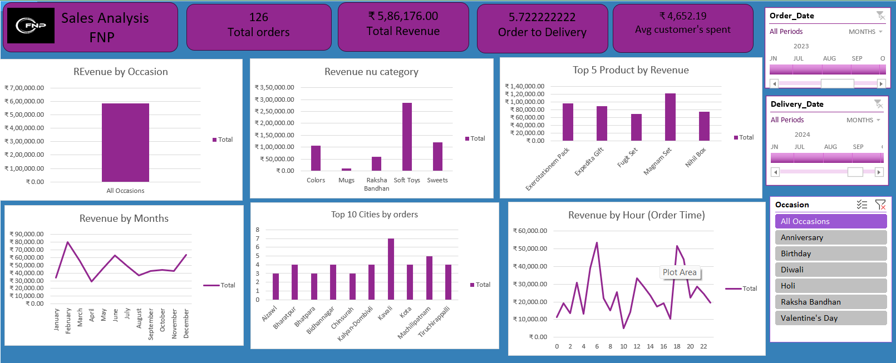

# FNP Sales Dashboard – Excel Automation & Power Query Reporting 🌸📊

This project is an Excel-based sales dashboard created to analyze and automate reporting for FNP (Ferns N Petals). The dashboard provides a complete view of sales trends across categories, order channels, regions, and time periods using Excel automation and Power Query.

---

## 🎯 Objective

- Analyze sales data for FNP using Excel automation and Power Query
- Visualize trends across order types, sales platforms, and customer segments
- Automate key metrics reporting using slicers, pivot tables, and charts

---

## 🛠️ Tools Used

- **Microsoft Excel**
  - Power Query (for data cleaning & transformation)
  - Pivot Tables
  - Slicers
  - Dynamic Charts (Bar, Pie, Line)
  - Conditional Formatting
  - Excel formulas (VLOOKUP, IF, COUNTIF, etc.)

---

## 📁 Project Files

- `FNP-sales.xlsx` – Main Excel dashboard file
- `dashboard_preview.png` – Dashboard screenshot image
- `README.md` – Project documentation file

---

## 📈 Dashboard Features

- 🔄 Power Query for automated data transformation  
- 📅 Month-wise Sales & Orders View  
- 🌐 Platform-wise Performance (Online vs Offline)  
- 🧁 Category-wise Sales (Cakes, Flowers, Gifts, etc.)  
- 📍 State-wise Top Sales Contributors  
- 🔄 Order Status Breakdown  
- 🎯 Slicers for filtering by region, category, month, and channel

---

## 📸 Dashboard Preview

