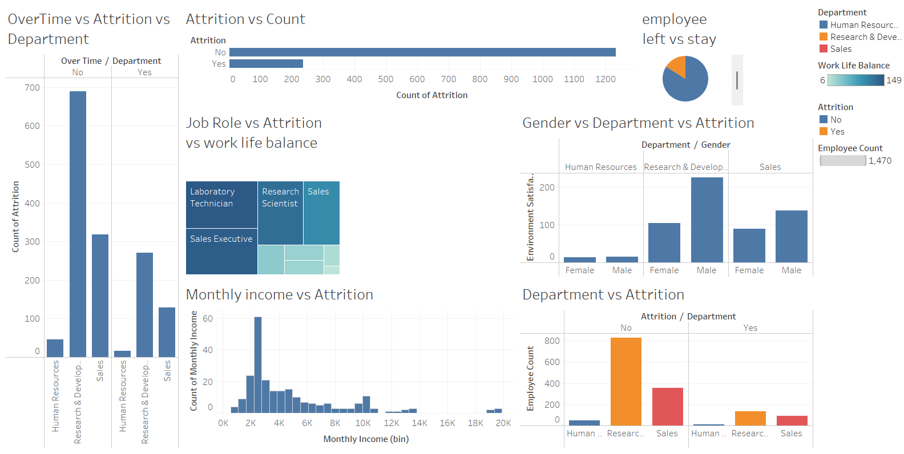

# HR Analytics Project – Employee Attrition Analysis 🧑‍💼📉

This project focuses on analyzing employee attrition trends using real-world HR data.  
The goal is to identify patterns and insights that can help reduce employee turnover and improve retention strategies.

---

## 📊 Objective

- Understand why employees are leaving the company
- Identify high-risk departments and employee categories
- Provide actionable insights using data-driven methods

---

## 🛠️ Tools & Technologies Used

- **Python**: Data cleaning, analysis (Pandas, Matplotlib)
- **SQL**: Extracted and filtered key HR metrics from database
- **Tableau**: Built interactive dashboards for visualization
- **Excel**: Used for initial data review and KPI tracking

---

## 📁 Project Files

- `hr_data_cleaning.py` – Python script for preprocessing
- `attrition_analysis.ipynb` – Notebook with all analysis steps
- `attrition_dashboard.twb` – Tableau dashboard file
- `employee_data.csv` – Sample HR dataset (anonymized)
- `README.md` – This file

---

## 📈 Key Insights

- Higher attrition in specific departments like Sales and HR
- Employees with less than 2 years tenure had higher turnover
- Overtime and job role were significant factors in attrition
- Suggested improvements in workload balance and employee engagement

---

## 📸 Sample Dashboard Screenshot

