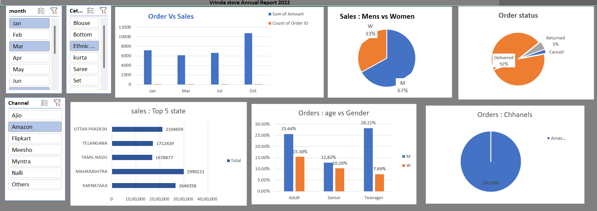

# Vrinda Store Sales Dashboard 📊📦

An interactive Excel-based sales dashboard created for Vrinda Store to analyze sales performance across product categories, customer segments, regions, and order statuses. This project focuses on automating business reporting and enabling quick data-driven decision-making.

---

## 🎯 Objective

- Automate monthly sales reporting using Excel
- Visualize key KPIs: orders, sales, age/gender-wise distribution, and channel performance
- Enable dynamic filtering with slicers for real-time insights

---

## 🛠️ Tools Used

- **Microsoft Excel**
  - Pivot Tables
  - Slicers
  - Conditional Formatting
  - Charts (Bar, Pie, Line)
  - Excel Automation (formulas + dynamic dashboards)

---

## 📈 Dashboard Features

- 📅 Monthly Order vs Sales Comparison  
- 👥 Gender & Age-wise Order Distribution  
- 🌍 Top Performing States  
- 🔄 Order Status Summary  
- 🧃 Category & Channel-wise Sales Tracking  
- 🧩 Slicers for filtering by month, channel, and product type

---

## 📸 Dashboard Preview

